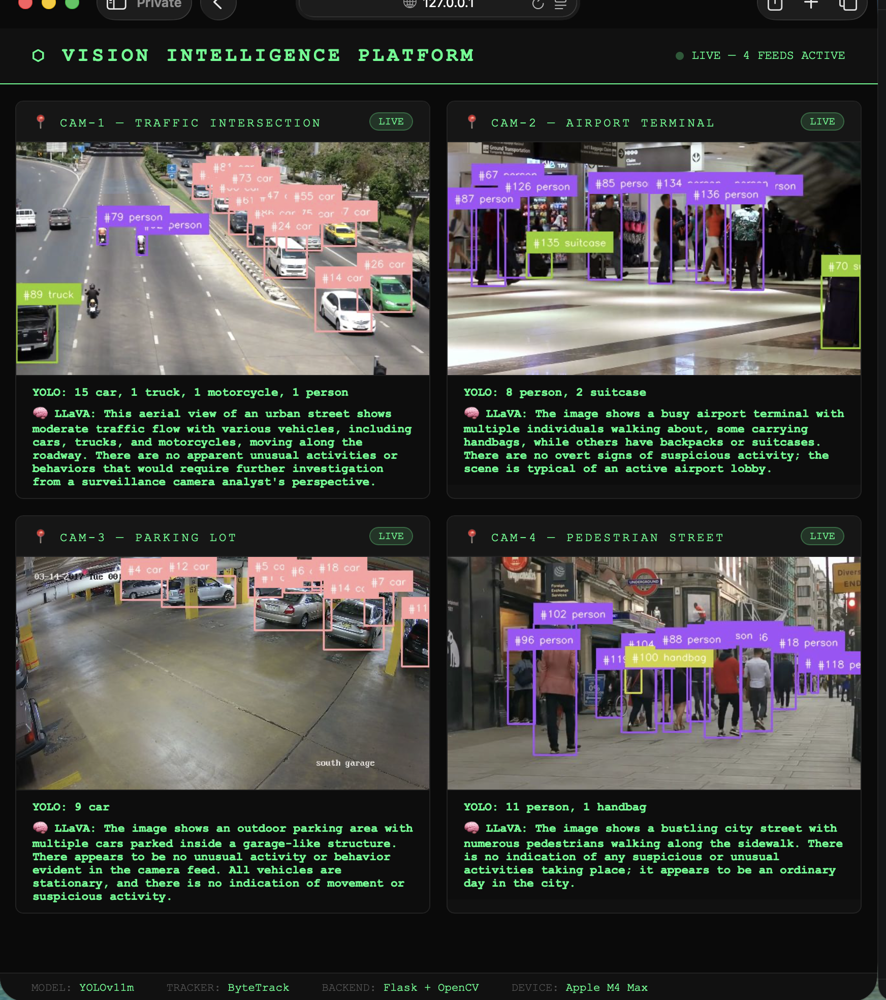

# 🎯 Vision Intelligence Platform

A production-grade, real-time multi-camera AI surveillance platform built entirely on local hardware. No cloud. No API keys. Just pure engineering.

## 🚀 What It Does

This platform combines **YOLOv11m object detection**, **ByteTrack multi-object tracking**, and **LLaVA vision AI** to create an intelligent surveillance system that doesn't just detect objects — it understands behavior.

**YOLO says:** `15 car, 3 truck, 4 person`

**LLaVA says:** `"Heavy traffic detected at the intersection. Several pedestrians navigating between stationary vehicles. No unusual activity observed."`

That's the difference between *perceptive* and *intelligent*.

---

## ✨ Features

- 🎥 **4 simultaneous camera feeds** — MJPEG streaming via Flask
- 🔍 **YOLOv11m detection** — vehicles, people, luggage and more
- 🏃 **ByteTrack tracking** — persistent object IDs across frames
- 🧠 **LLaVA scene understanding** — local vision LLM describing behavior
- ⚡ **Apple Silicon MPS acceleration** — full GPU utilization on M-series chips
- 🔒 **100% offline** — everything runs locally, zero data leaves your machine
- 🎨 **Professional dark UI** — military-style surveillance dashboard

---

## 🛠️ Tech Stack

| Component | Technology |
|-----------|------------|
| Object Detection | YOLOv11m (Ultralytics) |
| Object Tracking | ByteTrack (Supervision) |
| Scene Understanding | LLaVA via Ollama |
| Video Processing | OpenCV |
| Web Framework | Flask |
| GPU Acceleration | Apple Silicon MPS (PyTorch) |
| Frontend | HTML / CSS / JavaScript |

---

## 📋 Requirements

- Python 3.9+
- [Ollama](https://ollama.com) with LLaVA model
- Apple Silicon Mac (recommended) or any machine with GPU

---

## ⚙️ Installation

**1. Clone the repository**

git clone https://github.com/AftabAhmad5/vision-intelligence-platform.git
cd vision-intelligence-platform

**2. Create virtual environment**

python3 -m venv venv
source venv/bin/activate

**3. Install dependencies**

pip install -r requirements.txt

**4. Install Ollama and pull LLaVA**

ollama pull llava

**5. Add your camera feeds in app.py**

CAMERAS = {
    "cam1": "your_video.mp4",
    "cam2": "your_video2.mp4",
    "cam3": "your_video3.mp4",
    "cam4": "your_video4.mp4"
}

**6. Run**

python3 app.py

Open browser at **http://127.0.0.1:5000** 🚀

---

## 🏗️ Architecture

```
Video Sources (MP4 / Webcam / IP Camera)
        ↓
OpenCV Frame Capture
        ↓
[YOLOv11m + ByteTrack] — Detection & Tracking (every 4th frame)
        ↓
[LLaVA via Ollama] — Scene Understanding (every 60th frame, background thread)
        ↓
Flask MJPEG Stream
        ↓
Browser Dashboard
```

---

## 📁 Project Structure

```
vision-intelligence-platform/
    app.py              → Flask server & stream routing
    detector.py         → YOLOv11m + ByteTrack pipeline
    llm.py              → LLaVA scene analysis
    templates/
        index.html      → Surveillance dashboard UI
    requirements.txt    → Python dependencies
    .gitignore
```
---

## 🎯 Use Cases

- 🚗 Traffic monitoring & analysis
- ✈️ Airport/transit hub surveillance
- 🅿️ Parking lot management
- 🛍️ Retail foot traffic analysis
- 🏙️ Smart city infrastructure

---

## 🔧 Configuration

# detector.py
self.CONFIDENCE = 0.50   # Detection confidence (0.0 - 1.0)
self.FRAME_SKIP = 5      # Run YOLO every N frames

# llm.py
self.ANALYZE_EVERY = 60  # Run LLaVA every N frames

---

## 👨‍💻 Author

**Aftab Ahmad** — Electrical Engineer specializing in Computer Vision, IoT & Embedded Systems

- 🔗 [LinkedIn](https://www.linkedin.com/in/aftab-ahmad-lodhi/)
- 🐙 [GitHub](https://github.com/AftabAhmad5)

---
